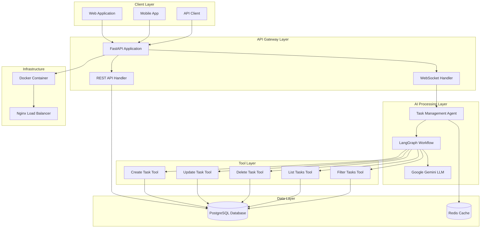
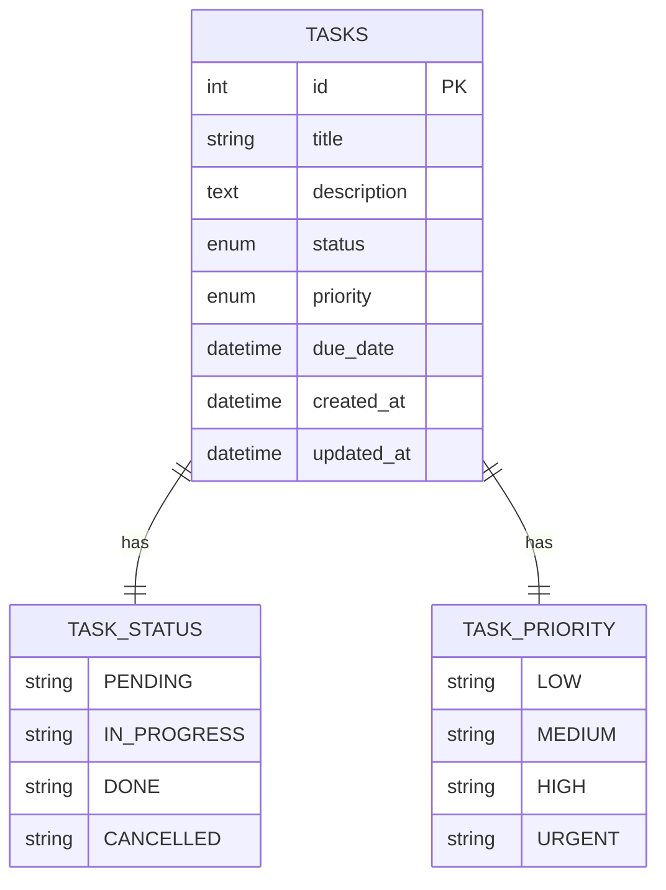
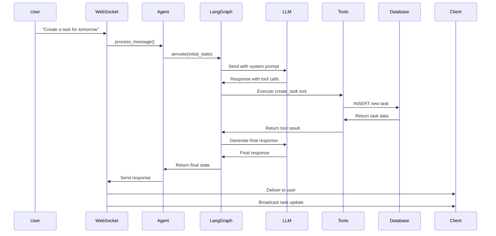
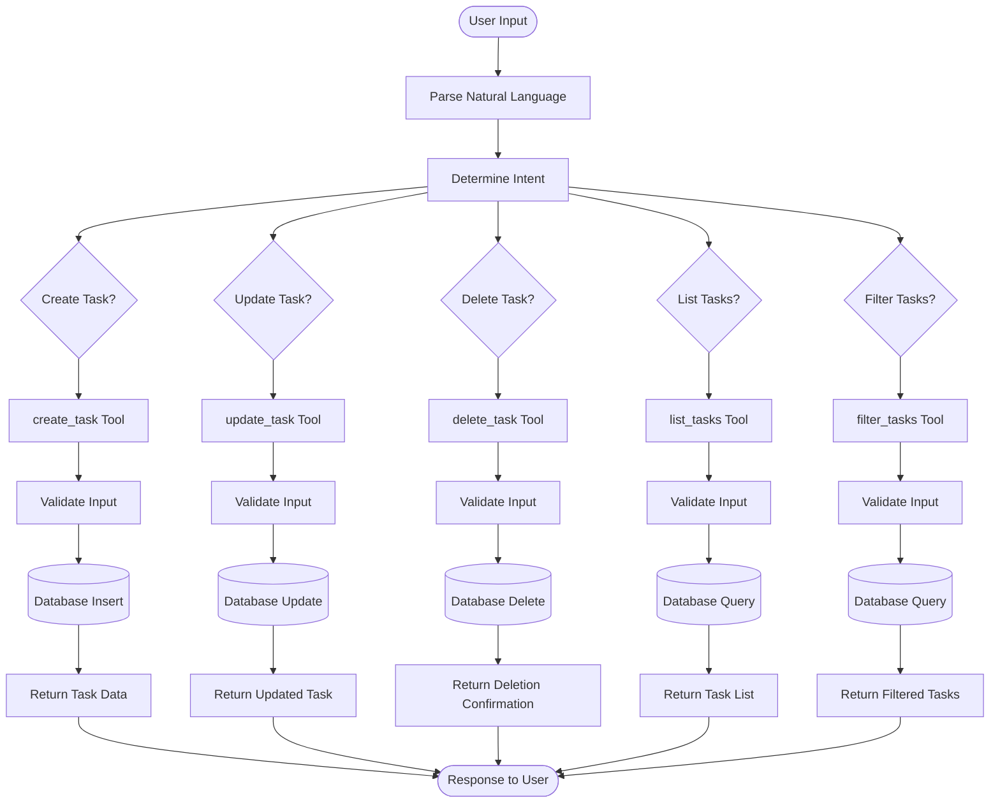
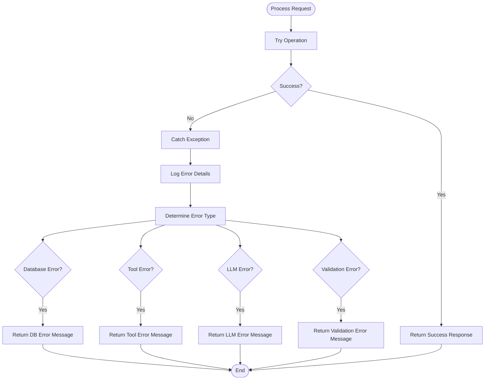
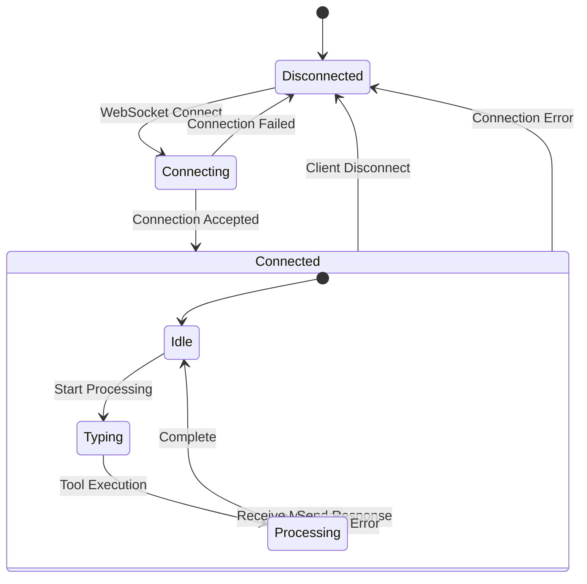
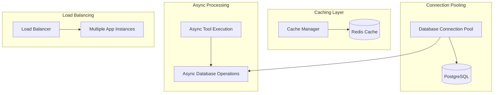

# Backend Architecture Diagrams

## System Architecture Overview



## LangGraph Workflow Detail

```mermaid
stateDiagram-v2
    [*] --> AgentNode

    state AgentNode {
        [*] --> ReceiveInput
        ReceiveInput --> ProcessWithLLM
        ProcessWithLLM --> CheckToolCalls
        CheckToolCalls --> [*]
    }

    AgentNode --> Decision{Has Tool Calls?}

    Decision -->|Yes| ExecuteTools
    Decision -->|No| GenerateResponse

    state ExecuteTools {
        [*] --> ExtractToolCalls
        ExtractToolCalls --> ExecuteAsyncTools
        ExecuteAsyncTools --> ProcessResults
        ProcessResults --> [*]
    }

    ExecuteTools --> GenerateResponse

    state GenerateResponse {
        [*] --> FormatResponse
        FormatResponse --> CreateUserMessage
        CreateUserMessage --> [*]
    }

    GenerateResponse --> [*]
```

## Database Schema



## Message Flow Sequence



## Tool Execution Flow



## Error Handling Flow



## WebSocket Connection Management



## Performance Optimization



This comprehensive architecture provides a robust, scalable, and intelligent task management system that can handle natural language processing, real-time communication, and complex database operations efficiently.
