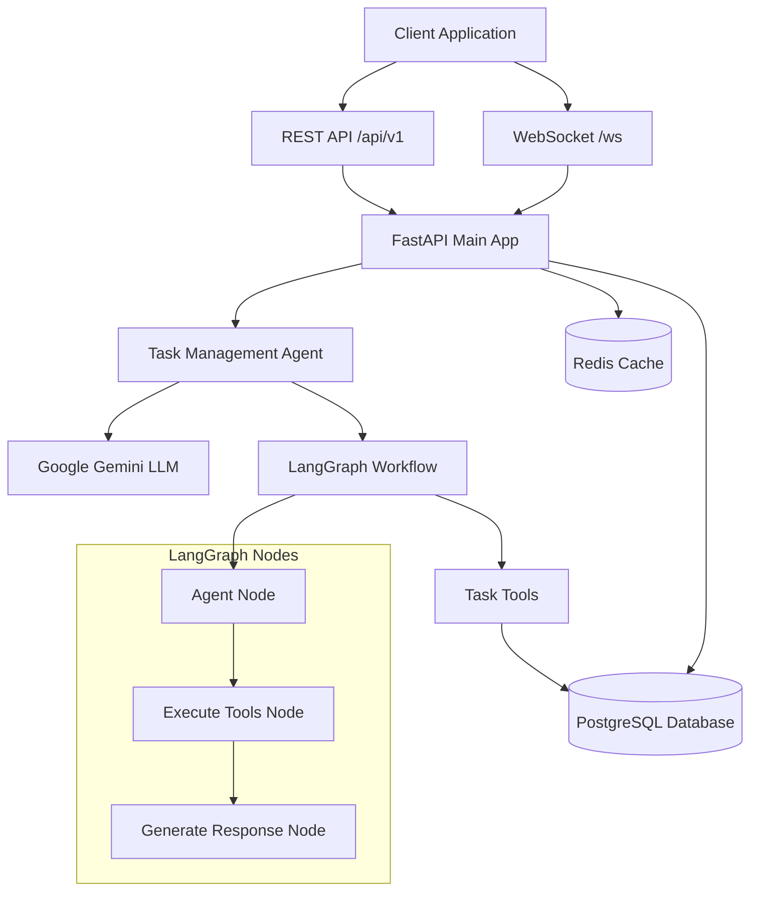
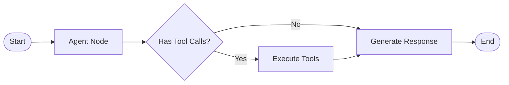
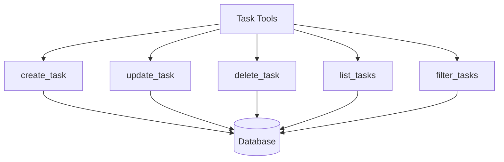
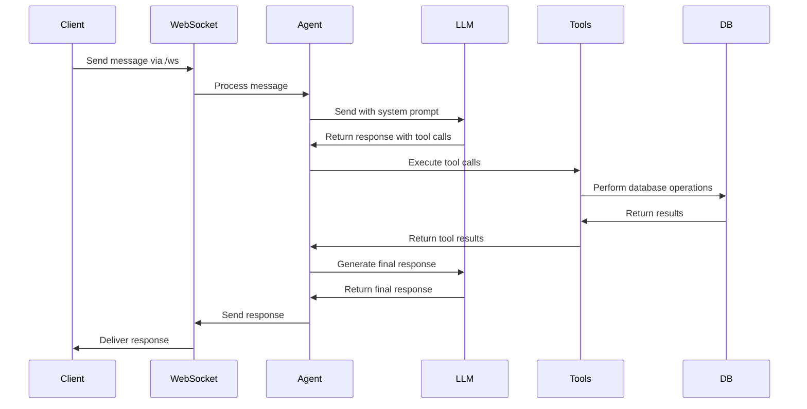
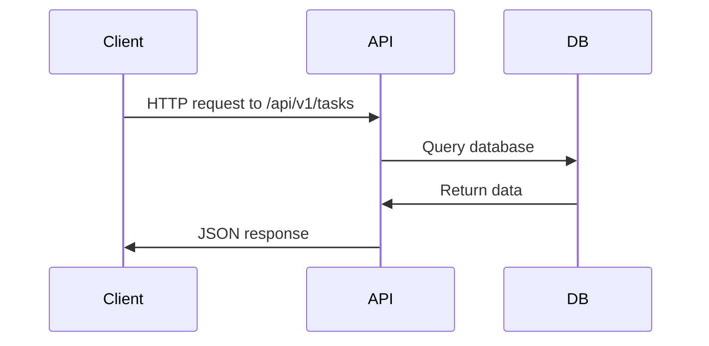

# AI Task Management Agent - Backend Workflow Documentation

## Overview

The AI Task Management Agent backend is a FastAPI-based application that uses LangChain and LangGraph to provide an intelligent task management system. The system processes natural language commands through WebSocket connections and executes task operations using AI-powered tools.

## Architecture Overview

## Core Components

### 1. FastAPI Application (`main.py`)

The main FastAPI application serves as the entry point and handles:

- WebSocket connections for real-time chat
- REST API endpoints for task management
- CORS middleware for cross-origin requests
- Database initialization and connection management

**Key Features:**

- WebSocket endpoint at `/ws` for real-time communication
- REST API routes at `/api/v1` for CRUD operations
- Connection manager for handling multiple WebSocket clients
- Health check endpoint at `/health`

### 2. Task Management Agent (`agents/task_agent.py`)

The core AI agent that processes natural language commands using LangChain and LangGraph.

**Components:**

- **LLM Integration**: Uses Google Gemini 2.5 Pro model
- **Tool Binding**: Binds task management tools to the LLM
- **State Management**: Manages conversation state and tool results
- **Workflow Orchestration**: Uses LangGraph for complex workflow management

### 3. LangGraph Workflow

The agent uses a three-node workflow:

#### Node Details:

**1. Agent Node (`agent_node`)**

- Receives user input and conversation history
- Sends messages to the LLM with system prompts
- Determines if tools need to be called
- Returns updated state with LLM response

**2. Execute Tools Node (`execute_tools`)**

- Processes tool calls from the LLM
- Executes async task management tools
- Handles tool results and errors
- Updates conversation state with tool messages

**3. Generate Response Node (`generate_response`)**

- Creates final response based on tool results
- Provides user-friendly feedback
- Formats the response for the client

### 4. Task Tools (`tools/task_tools.py`)

Async tools that perform actual task operations:

**Tool Functions:**

- `create_task`: Creates new tasks with natural language date parsing
- `update_task`: Updates existing tasks by ID or title
- `delete_task`: Deletes tasks by ID or title
- `list_tasks`: Lists tasks with optional filtering
- `filter_tasks`: Advanced filtering with text search

### 5. Database Layer

**Models (`models/task.py`):**

- `Task`: SQLAlchemy model with status, priority, and date fields
- `TaskStatus`: Enum for task states (pending, in_progress, done, cancelled)
- `TaskPriority`: Enum for priority levels (low, medium, high, urgent)

**Database Configuration (`db/database.py`):**

- Async SQLAlchemy engine with PostgreSQL
- Connection pooling and session management
- Migration support with Alembic

## Complete Workflow

### 1. WebSocket Message Processing

### 2. REST API Processing

## Data Flow

### 1. User Input Processing

1. **WebSocket Connection**: Client connects to `/ws` endpoint
2. **Message Reception**: WebSocket receives JSON message with user input
3. **Agent Processing**: Message sent to `task_agent.process_message()`
4. **State Initialization**: Agent creates initial state with user input

### 2. LangGraph Execution

1. **Agent Node**:

   - Adds system prompt to conversation
   - Sends messages to Gemini LLM
   - LLM determines if tools are needed
   - Returns response with potential tool calls

2. **Tool Execution** (if needed):

   - Extracts tool calls from LLM response
   - Executes corresponding async tools
   - Tools perform database operations
   - Results are formatted and returned

3. **Response Generation**:
   - Final response generated based on tool results
   - User-friendly message created
   - State updated with final response

### 3. Response Delivery

1. **WebSocket Response**: Final response sent back to client
2. **Broadcast Updates**: If tasks were modified, all clients notified
3. **Real-time Updates**: Clients receive task list updates

## Key Features

### Natural Language Processing

- Understands natural language commands
- Parses relative dates ("tomorrow", "next week")
- Handles task identification by ID or partial title
- Supports conversational task management

### Real-time Communication

- WebSocket-based real-time updates
- Typing indicators during processing
- Broadcast updates to all connected clients
- Connection management for multiple users

### Database Operations

- Async PostgreSQL operations
- Connection pooling for performance
- Transaction management
- Migration support with Alembic

### Error Handling

- Comprehensive error handling at all levels
- Graceful degradation for tool failures
- User-friendly error messages
- Logging for debugging and monitoring

## Configuration

### Environment Variables

- `DATABASE_URL`: PostgreSQL connection string
- `GEMINI_API_KEY`: Google Gemini API key
- `REDIS_URL`: Redis connection string
- `SECRET_KEY`: JWT secret key
- `ALLOWED_ORIGINS`: CORS allowed origins

### Dependencies

- **FastAPI**: Web framework
- **LangChain**: LLM integration
- **LangGraph**: Workflow orchestration
- **SQLAlchemy**: Database ORM
- **PostgreSQL**: Primary database
- **Redis**: Caching layer
- **Google Gemini**: LLM provider

## API Endpoints

### WebSocket

- `GET /ws`: WebSocket connection for real-time chat

### REST API

- `GET /api/v1/tasks`: List tasks with filtering
- `GET /api/v1/tasks/{task_id}`: Get specific task
- `POST /api/v1/tasks`: Create new task
- `PUT /api/v1/tasks/{task_id}`: Update task
- `DELETE /api/v1/tasks/{task_id}`: Delete task
- `GET /api/v1/tasks/stats/summary`: Get task statistics

### Health Check

- `GET /health`: Application health status

## Deployment

The application can be deployed using:

- **Docker**: Using the provided Dockerfile
- **Docker Compose**: For local development with database
- **Production**: With proper environment configuration

## Security Considerations

- CORS configuration for cross-origin requests
- Input validation using Pydantic models
- SQL injection prevention through SQLAlchemy ORM
- WebSocket connection management
- Environment-based configuration

This architecture provides a robust, scalable, and intelligent task management system that can understand natural language commands and execute complex workflows using AI-powered tools.
